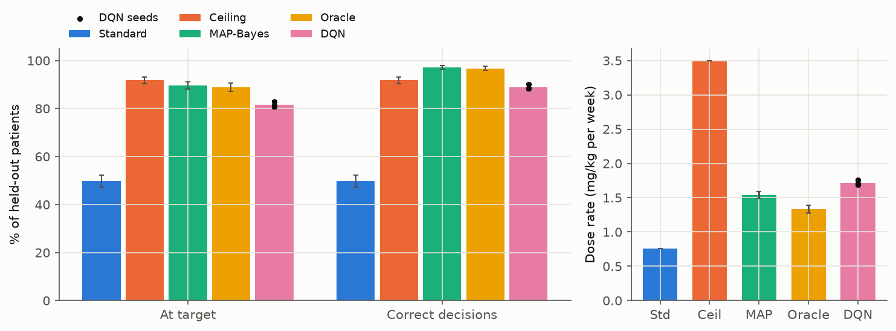
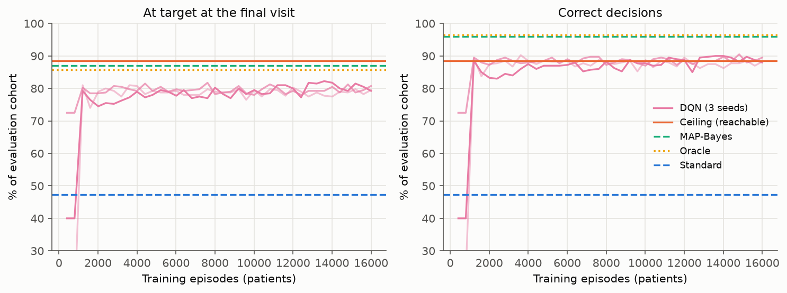
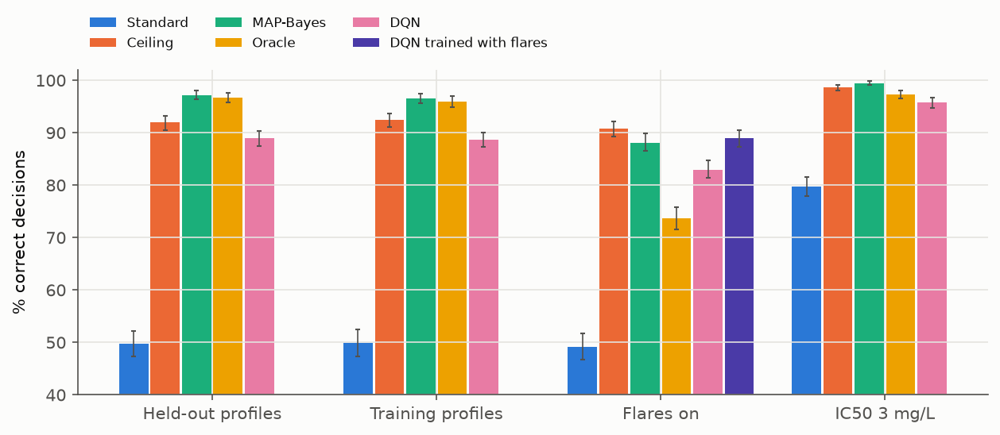
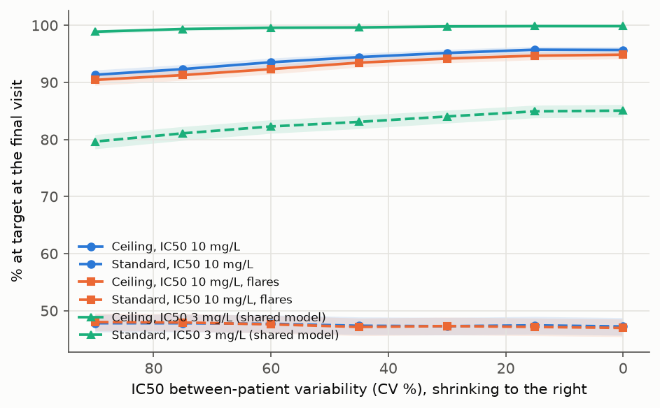
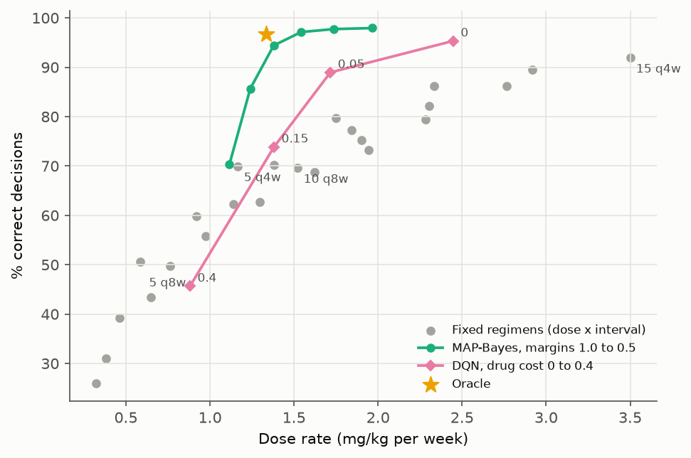
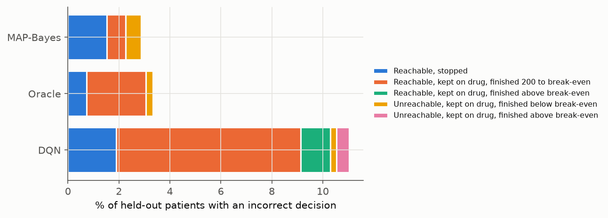
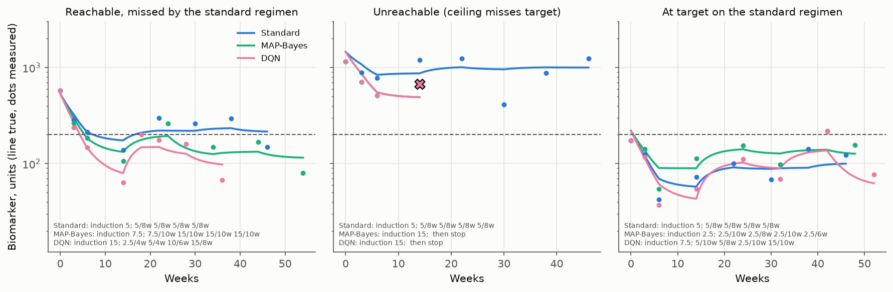

# DQN dose optimization on a simulated PK/PD model

[](https://github.com/Wrlog/rl-dosing-demo/actions/workflows/tests.yml)

A Deep Q-Network that picks doses for a hypothetical drug ("Drug X") on a mechanistic PK/PD simulator.
It makes an induction decision, then four maintenance decisions (dose and interval), and can stop Drug X
and move the patient to another treatment. I compare it on the same held-out virtual patients with the
standard regimen, a maximum-intensity ceiling regimen, a MAP-Bayesian dosing rule and an oracle. This
follows the general approach of my PhD work on model-informed precision dosing; the real data and
results from that work are not public.

Everything here is simulated from made-up parameters. It hasn't been validated against anything and
isn't for patient care. It's for research and teaching only.

## Main result

1,500 virtual patients built from covariate profiles the DQN never saw in training. 95% bootstrap CIs
(1,000 replicates over patients). The DQN row averages three training seeds.

| Policy | At target | Correct decisions | Stopped | Dose rate (mg/kg/week) | Cave CV | Weeks to sustained target |
|---|---:|---:|---:|---:|---:|---:|
| Standard (5 mg/kg, then every 8 weeks) | 49.8% (47.3 to 52.2) | 49.8% | 0% | 0.76 | 53% | 7.2 |
| Ceiling (15 mg/kg, then every 4 weeks) | 91.9% (90.5 to 93.2) | 91.9% | 0% | 3.50 | 43% | 7.8 |
| MAP-Bayes | 89.7% (88.1 to 91.1) | 97.1% (96.3 to 98.0) | 9.0% | 1.54 (1.49 to 1.59) | 110% | 10.9 |
| Oracle (true parameters) | 88.9% (87.2 to 90.5) | 96.7% (95.8 to 97.6) | 8.5% | 1.33 (1.28 to 1.39) | 109% | 11.4 |
| DQN, 3 seeds | 81.6% (79.8 to 83.4) | 89.0% (87.5 to 90.3) | 9.2% | 1.72 (1.68 to 1.76) | 74% | 9.1 |

The DQN loses to the MAP-Bayesian comparator. On the same patients it brings 8.0 percentage points
fewer to target (95% CI 6.7 to 9.3), makes 8.2 points fewer correct decisions (6.9 to 9.4), and uses
0.17 mg/kg/week more drug (0.16 to 0.19). Its mean return, the thing it was trained on, is also lower
(by 0.042, CI 0.034 to 0.051). The three seeds agree (81.3%, 82.8% and 80.9% at target). The DQN is
still far better than the standard regimen: +31.8 points at target (29.6 to 34.0) and +39.2 points of
correct decisions. It stops about the same share of patients as MAP-Bayes, and most of its extra
misses are reachable patients left just above target (see "Misses" below).

"Correct" means a reachable patient ends at target, or an unreachable patient is moved to another
treatment. A patient is reachable if the ceiling regimen, run on the same patient with the same random
draws, gets the true biomarker below 200 at its final visit. An unreachable patient who still ends at
target (rare, since the arms differ in visit timing) also counts as correct. Reachability is only used
for scoring; no policy sees it. 91.9% of these patients are reachable.



## The simulated patient

This uses the shared Drug X model from my other demo repos. Time is in days, doses in mg/kg,
concentrations in mg/L and the biomarker in units.

- PK: two compartments, 2 h IV infusion. CL = 0.30 L/day × (WT/70)^0.75 × (ALB/4)^-1 × (INF/5)^0.10 ×
  1.8^ADA, V1 = 3.2 L × WT/70, Q = 0.50 L/day × (WT/70)^0.75, V2 = 2.0 L × WT/70. Between-patient
  variability of 30% on CL and 20% on V1, and 15% between-occasion variability on CL (one occasion per
  dosing interval).
- PD: an indirect response where Drug X inhibits production of the biomarker,
  `dB/dt = kin (1 − Cave/(IC50 + Cave)) − kout B`, with kout 0.04/day and B starting at BASE. Cave is the
  average concentration over each dosing interval, held constant within it. BASE = 600 × (INF/5)^0.30
  (60% variability) and IC50 = 10 mg/L × (PLT/300)^0.40 (90% variability).
- At every infusion visit I measure a trough concentration (15% proportional error, LLOQ 0.5 mg/L), the
  biomarker (25% proportional error) and ADA status. The biomarker measured at a visit is the value at
  the end of the interval that just finished, so it reflects that interval's Cave. It's easy to get
  this off by one interval, so there's a test for it
  (`test_biomarker_is_recorded_at_the_end_of_each_interval`).
- ADA can turn positive during treatment. The chance per interval is 0.12 × exp(−trough / 2 mg/L), so
  it's more likely when exposure is low.
- Flares are optional: between-occasion variability on BASE of 35% CV per interval. They're off in the
  main runs and on in one sensitivity run.
- Target: the true biomarker below 200 units.

One change from the shared model: the typical IC50 is 10 mg/L instead of 3. With 3 mg/L, 98.6% of
these patients reach target on the ceiling regimen and 79.7% on the standard one, so stopping is almost
never the right call and there isn't much to optimize. I kept the shared value as a sensitivity run.

The PK is solved exactly over each interval (the two-compartment solution with a zero-order input, and
the exact integral for Cave), and so is the PD step, because Cave is constant within an interval. The
tests check both against a fine-grid RK4 solution.

Virtual patients are a covariate profile plus fresh random effects. I simulate a pool of 1,200 profiles
(weight, albumin, INF, PLT, baseline ADA). INF and albumin come from a shared latent inflammation score,
so they correlate. 25% of the profiles are held out. Training only uses the other 900, each time with
new random effects on CL, V1, BASE and IC50 and new draws for everything else.

## The decision problem

An episode is one patient and five decisions:

1. Day 0: the induction dose, 2.5 to 15 mg/kg in steps of 2.5 (6 actions), given at days 0, 21 and 42.
2. Day 98 (where the standard regimen gives its first maintenance dose) and the next three visits: a
   maintenance regimen of 2.5 to 15 mg/kg in steps of 2.5, every 4, 6, 8 or 10 weeks (24 actions), or
   stop Drug X (1 action).

Stopping is masked at the induction decision, since no biomarker after induction exists yet, and it can
be switched off altogether (`allow_stop=False`). The mask applies to random exploration, to the greedy
choice and to the max in the Q-learning target.

The agent sees 16 numbers: the phase and decisions left, the log measured biomarker at baseline, at the
previous visit and now, the log measured trough with a below-LLOQ flag, the last dose and interval, the
induction dose, weeks since the start, the latest ADA result, and weight, albumin, INF and PLT at
baseline. It never sees CL, IC50, BASE or whether the patient is reachable.

The reward after each interval uses the true biomarker B at the end of it:

```
reward = −min(max(log2(B / 200), 0), 3) − λ × dose rate (mg/kg per week)
```

Nothing is lost below target, and each doubling above target costs 1, up to 3. λ is a drug cost weight,
0.05 in the main runs. Stopping ends the episode with −0.35 for each maintenance decision left, so
stopping pays off once the biomarker is expected to stay above about 255 units (200 × 2^0.35), a little
lower once drug cost counts. Discount factor 0.97.

## The policies

- Standard: 5 mg/kg at days 0, 21 and 42, then 5 mg/kg every 8 weeks.
- Ceiling: the most intense option in the action space, 15 mg/kg induction and then 15 mg/kg every 4
  weeks. It defines reachability.
- MAP-Bayes: at each decision it estimates the patient's parameters from what has been measured so far,
  PK first and then PD. CL and V1 come from the troughs (values below LLOQ are dropped), then BASE and
  IC50 come from the biomarkers, with Cave per interval from the PK estimates. It then predicts the
  biomarker at the next visit under every regimen and takes the cheapest one (lowest mg/kg per week)
  predicted to land below a margin × 200. If none does, it gives the strongest regimen. If even the
  strongest regimen, held to the last decision, is predicted to finish above target, it stops. Its model
  ignores IOV on CL and flares. The margin (0.7) was picked from 1.0 to 0.5 by mean return on the DQN's
  checkpoint cohort, so both get the same tuning data.
- Oracle: the same rule with the patient's true parameters and current state, but no knowledge of
  future IOV, flares or ADA onset. Its margin (0.9) was tuned the same way. It's myopic, so it isn't the
  true optimum. It has the best mean return of any policy (−0.52, against −0.66 for MAP-Bayes and −0.70
  for the DQN) and uses the least drug of the three adaptive policies.
- DQN: a shared trunk (128 and 64 ReLU units) with two linear heads, 6 outputs for induction and 25 for
  maintenance. Each transition only trains the head its decision used. Double DQN targets, Huber loss,
  a 50,000-transition uniform replay buffer, batch 128, target network copied every 400 gradient steps,
  Adam from 5e-4 decaying to 5e-5, gradient clipping at 5. Epsilon-greedy over the allowed actions,
  from 1.0 to 0.03 over 60% of training after 800 purely random episodes. 16,000 episodes, run 32
  patients at a time with 12 gradient steps per batch step. Every 400 episodes the greedy policy is
  scored on a fixed cohort of 400 patients (training profiles, separate from the test patients), and the
  checkpoint with the best mean return is kept. Three seeds.

I tried a bigger trunk (256 and 128, and three layers), a lower learning rate with more updates,
γ = 0.9 and a larger batch, each for 30,000 episodes. None moved the checkpoint return by more than
about 0.02, so I kept the smaller setup.

## Results

### Learning curve



On the checkpoint cohort, the DQN gets to about 80% at target within the first 1,500 episodes and then
stays flat, short of the ceiling (88.5% of that cohort is reachable) and of MAP-Bayes (87.0%). On correct
decisions it sits just above the ceiling line, because it also stops some unreachable patients, but
well under MAP-Bayes and the oracle (96.0% and 96.5%). The best checkpoints were at episodes 16,000,
16,000 and 12,416.

### Held-out profiles, flares and the shared IC50



| Scenario | Reachable | Standard | MAP-Bayes | Oracle | DQN (3 seeds) |
|---|---:|---:|---:|---:|---:|
| Held-out profiles (main) | 91.9% | 49.8 / 49.8 | 89.7 / 97.1 | 88.9 / 96.7 | 81.6 / 89.0 |
| Training profiles, new random effects | 92.4% | 49.9 / 49.9 | 89.7 / 96.6 | 88.7 / 96.0 | 81.8 / 88.7 |
| Flares on | 90.7% | 49.1 / 49.1 | 80.0 / 88.1 | 66.1 / 73.7 | 75.0 / 82.9 |
| IC50 3 mg/L (shared model) | 98.6% | 79.7 / 79.7 | 98.3 / 99.5 | 96.0 / 97.3 | 94.5 / 95.7 |

Cells are % at target / % correct decisions, 1,500 patients each. The shared-IC50 DQN is a single
network (seed 0) trained in that setting.

- The held-out profile split makes no difference for any policy here (81.6% against 81.8% at target for
  the DQN). The covariate pool is simulated from one distribution, so this mostly checks that the
  network isn't memorizing profiles.
- With flares, every adaptive policy drops. The DQN trained without flares falls to 75.0% at target. A
  DQN trained with flares (seed 0) gets 80.7% at target and 88.9% correct, level with MAP-Bayes (paired
  difference +0.7 points at target, CI −0.9 to 2.3), but it gives 0.37 mg/kg/week more drug (0.34 to
  0.39). The oracle does worst of the three. Its margin of 0.9 was tuned without flares and leaves
  little room for a flare in the next interval.
- With the shared IC50 of 3 mg/L, the gap narrows but MAP-Bayes still wins: −3.8 points at target for
  the DQN (−4.9 to −2.9), with 0.17 mg/kg/week more drug.

### Reachability as IC50 variability shrinks



I recomputed reachability for 4,000 new patients, changing only the IC50 variance and keeping every
other draw fixed. With the main settings, the share reachable on the ceiling regimen goes from 91.3% at
90% CV to 93.5% at 60%, 95.2% at 30% and 95.7% at 0%. So IC50 variability accounts for about half of
the unreachable patients; the rest come from high BASE and fast clearance (including ADA). Flares take
off roughly another point at every rung. The standard regimen stays at 47% to 48% all the way down,
because with a typical IC50 of 10 mg/L its exposure is too low for the typical patient, however little
patients differ. With the shared IC50 of 3 mg/L, the ceiling reaches 98.9% to 99.8%.

### Drug cost trade-off



Gray points are the 24 fixed regimens (same dose for induction and maintenance, never stopping). The
MAP-Bayes line runs over its margin from 1.0 to 0.5, and the DQN line over its drug cost λ.

| DQN drug cost λ | At target | Correct | Stopped | Dose rate |
|---:|---:|---:|---:|---:|
| 0 | 89.5% | 95.3% | 6.2% | 2.45 |
| 0.05 (main, 3 seeds) | 81.6% | 89.0% | 9.2% | 1.72 |
| 0.15 | 65.9% | 73.9% | 22.2% | 1.38 |
| 0.4 | 37.6% | 45.7% | 57.1% | 0.88 |

With no drug cost, the DQN gets close to MAP-Bayes on outcome (95.3% correct against 97.1%) but uses
60% more drug. As λ rises it cuts drug mainly by stopping more patients, since the other treatment
carries no drug cost in this reward. That's a property of my reward, and it shows how much the policy
depends on it. At every dose rate the MAP-Bayes line is above the DQN line. For example, at about
1.38 mg/kg/week MAP-Bayes (margin 0.8) makes 94.4% correct decisions and the DQN (λ 0.15) makes 73.9%.
MAP-Bayes beats every fixed regimen at a similar dose rate. The DQN does too, except at λ 0.4, where it
stops so many patients that 5 mg/kg every 6 weeks (59.8% correct at 0.92 mg/kg/week) does better.

### Misses



Out of 1,500 held-out patients (DQN averaged over seeds):

| Kind of miss | DQN | MAP-Bayes | Oracle |
|---|---:|---:|---:|
| Reachable, stopped | 28.3 | 23 | 11 |
| Reachable, kept on drug, finished 200 to 255 | 108.7 | 11 | 35 |
| Reachable, kept on drug, finished above 255 | 17.3 | 0 | 0 |
| Unreachable, kept on drug, finished below 255 | 3.7 | 9 | 4 |
| Unreachable, kept on drug, finished above 255 | 7.7 | 0 | 0 |
| Total | 165.7 | 43 | 50 |

Most of the DQN's misses are reachable patients who finish just above target. The reward costs little
there (a biomarker of 230 costs 0.2, about what the drug cost adds for moving from 5 mg/kg every 8
weeks to 15 mg/kg every 4 weeks), and the biomarker is measured with 25% error, so the agent settles for regimens that land near the line.
MAP-Bayes avoids this with its explicit 0.7 margin. Most unreachable patients are stopped by every
adaptive policy; the few kept on drug by MAP-Bayes are ones it predicted it could still reach.

### Other endpoints

- Exposure variability (between-patient CV of Cave in the last interval) is 53% on the standard
  regimen, 110% on MAP-Bayes and 74% on the DQN. Dosing to each patient's need spreads exposure out, so
  a higher CV here isn't a bad sign by itself.
- Weeks to sustained target is the first visit from which the true biomarker stays below 200 through
  the final visit, averaged over the patients who get there. It's conditional on success, so the
  standard regimen looks quick (7.2 weeks) because it only succeeds in easy patients. MAP-Bayes takes
  10.9 weeks and the DQN 9.1. Part of that is induction: MAP-Bayes gives 8.5 mg/kg on average (it only
  knows the covariates and the baseline biomarker at that point) and the DQN 10.4 mg/kg.
- ADA positivity by the end: 26% on the standard regimen, 22% on MAP-Bayes, 18% on the DQN and 9% on
  the ceiling regimen, since low troughs make ADA more likely.



## Limitations

- The DQN only sees the latest two biomarker values, the baseline and one trough. MAP-Bayes uses every
  measurement through a model with the right structure and the true population priors, which is a big
  advantage. A recurrent network or a longer history in the state might close some of the gap. I didn't
  try that here.
- The typical IC50 differs from the shared Drug X model (10 against 3 mg/L), as explained above.
- The reward is my own choice, and the cost sweep shows the policy moves a lot when it changes. The
  shallow penalty just above target explains most of the DQN's misses.
- MAP-Bayes and the oracle are myopic: they look one interval ahead, plus the stop check.
- Everything is trained and tested on patients from the same simulator. A real population would differ
  in ways the simulator doesn't contain. With real data this would have to be offline RL from logged
  decisions, with safety constraints and off-policy evaluation.
- The flare-trained and shared-IC50 DQNs are one seed each.

## Running it

Needs Python 3.12. On Windows use `.venv\Scripts\activate`.

```bash
python -m venv .venv
source .venv/bin/activate
pip install torch --index-url https://download.pytorch.org/whl/cpu
pip install -r requirements.txt
pip install -e .

pytest -q                           # 1 to 2 min
python scripts/run_all.py           # train, evaluate, analyses, figures
python scripts/run_all.py --quick   # small version (2,000 episodes, 300 test patients), about 3 min
```

`run_all.py` runs `train.py` (eight networks in parallel processes), `evaluate.py`, `analyses.py` and
`make_figures.py` in turn. The full run took 8 min 16 s on a 14-thread laptop CPU (Intel Core Ultra 7
165U) while other jobs were also running: 6 min to train, about 2 min to evaluate. On its own, one
network takes a bit over a minute. Trained networks and all result CSVs are in the repo, so
`evaluate.py`, `analyses.py` and `make_figures.py` also run without retraining. Results were produced
with Python 3.12.10, PyTorch 2.14.0 (CPU), NumPy 2.5.3 and pandas 3.0.6 on Windows. Training is
deterministic for a given seed on one machine but may shift slightly across versions or platforms. The
`--quick` outputs go to `models_quick/`, `results_quick/` and `figures_quick/`, which are gitignored.

## Layout

```
src/rl_dosing/
  model.py        Drug X parameters, covariate profiles, virtual patients, exact PK and PD steps
  env.py          batched environment: actions, masks, observation, reward, visit records
  policies.py     fixed regimens, MAP-Bayes (with a small batched optimizer), oracle
  dqn.py          two-head Q-network, replay, training loop, greedy policy
  metrics.py      per-patient endpoints, bootstrap summaries, paired differences
  experiment.py   profile pool and split, cohorts, main settings, the training runs
scripts/          train.py, evaluate.py, analyses.py, make_figures.py, run_all.py
tests/            PK and PD against RK4, biomarker timing, masks, stop payoff, observation contents,
                  MAP recovery, head separation, reproducible training
models/           trained networks and their settings
results/          learning curves, per-patient tables, summaries, frontier, ladder, misses (CSV)
figures/          the figures above, drawn with matplotlib from results/
```

## Related reading

Irie K, Tan WR, Mizuno T. Towards reinforcement learning-enabled model-informed precision dosing:
concepts, applications, and implementation. Ther Drug Monit. 2026. In press.

## License

MIT. See [LICENSE](LICENSE).
